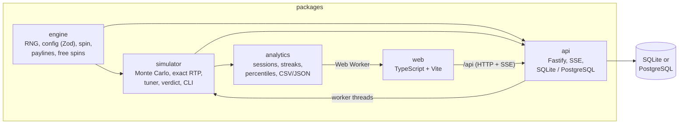
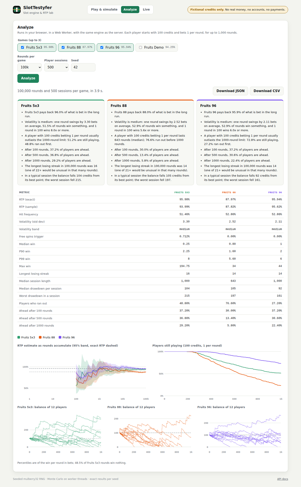

# SlotTestyfer

[](https://github.com/nunotapxD/SlotTestyfer/actions/workflows/ci.yml)


A slot machine engine and RTP lab in TypeScript. It proves, by simulation and by exact maths,
that a game pays what it should, and shows what that means for a player.

> Fictional credits only. There is no real money, no player accounts and no payments.


## What it does

- **Plays games** defined as JSON: reels, paylines, wilds, scatters and free spins, validated in
  full before they run. Every round is reproducible from its seed.
- **Certifies RTP** with Monte Carlo on worker threads (about 1M rounds/s per core) and gives a
  PASS / FAIL / INCONCLUSIVE verdict that accounts for sampling error.
- **Computes the exact RTP by formula** in milliseconds, for any game size, and uses it to
  **tune** games to a target RTP.
- **Analyses the player experience**: how long 100 credits last, the chance of being ahead after
  100, 500 and 1000 rounds, losing streaks, drawdowns, percentiles, side-by-side comparisons.
- **Streams live runs** over Server-Sent Events: the RTP and its confidence band closing in, a live
  verdict, virtual players and alerts, with pause, resume, cancel and speed control.
- **Blocks bad releases**: CI fails if a game stops paying 96% ± 0.5%.

## Results

| Game              | Layout                    | Exact RTP | 10M rounds, seed 42 (95% CI) | Verdict at 96% ± 0.5% |
| ----------------- | ------------------------- | --------- | ---------------------------- | --------------------- |
| `fruits-96.json`  | 3x3, 5 lines              | 95.94%    | 95.970% ± 0.132%             | PASS                  |
| `fruits-88.json`  | 3x3, 5 lines              | 87.98%    | 88.093% ± 0.156%             | FAIL                  |
| `fruits-5x3.json` | 5x3, 20 lines, free spins | 95.98%    | 95.952% ± 0.212%             | PASS                  |

For `fruits-5x3`, 70.9% of the RTP comes from line wins, 1.7% from scatters and 23.3% from free
spins, which trigger once every 140 rounds. The formula and the simulation agree within the
confidence interval, and the formula matches a full enumeration of every reel combination to 15
decimal places.

What a player experiences, from `npm run analyze` (100,000 rounds and 1,000 sessions per game):

| With 100 credits, betting 1 per round | fruits-96 | fruits-88 | fruits-5x3 |
| ------------------------------------- | --------- | --------- | ---------- |
| Ran out before 1,000 rounds           | 27.8%     | 75.5%     | 48.3%      |
| Ahead after 100 rounds                | 38.1%     | 30.5%     | 36.5%      |
| Ahead after 1,000 rounds              | 24.6%     | 5.5%      | 30.0%      |
| Volatility (std dev per round, bets)  | 2.11      | 2.52      | 3.30       |

A 96% game still leaves most players behind in a session: RTP is a long-run average, and
volatility decides how far a single session strays from it.


## Quick start

Requires Node.js 22.13+ (for the built-in SQLite) and, for the full stack, Docker.

```bash
npm install
npm run check                    # lint + format + build + tests

npm run api                      # API on :3000 (interactive docs at /docs)
npm run web                      # web page on :5173

docker compose up -d --build     # PostgreSQL + API + web page on :8080
```

Command line tools:

```bash
npm run simulate -- --game games/fruits-96.json --spins 10e6 --seed 42 --target 96
npm run simulate -- --game games/fruits-5x3.json --exact --target 96        # exact, instant
npm run tune -- --game games/fruits-5x3.json --target 94 --out games/fruits-94.json
npm run analyze -- --game games/fruits-96.json --game games/fruits-88.json  # JSON + CSV
docker compose run --rm simulator                                           # report in ./reports
```

## Architecture



| Package     | Responsibility                                                                    | Runs in          |
| ----------- | --------------------------------------------------------------------------------- | ---------------- |
| `engine`    | Seeded mulberry32 RNG, game schema, spins, line/wild/scatter wins, free spins     | Node and browser |
| `simulator` | Totals in exact integers, reports, confidence intervals, verdicts, formula, tuner | Node (core: any) |
| `analytics` | Round samples, sessions, streaks, drawdowns, percentiles, comparisons, exports    | Node and browser |
| `api`       | REST + SSE, background queue, live runs in worker threads, OpenAPI                | Node             |
| `web`       | Play, simulate, analyse (in a Web Worker) and watch live runs                     | Browser          |



## Technical decisions

- **Reproducible by construction.** Every random decision goes through a seeded RNG, and a round
  is fully described by its reel stops. Any spin can be replayed and audited.
- **Deterministic in parallel.** Simulations are split into fixed-size chunks and chunk _i_
  always uses `deriveSeed(seed, i)`. Totals are exact integers (wins in line bets), so the same
  seed gives the same report on 2 cores or 64.
- **Whole cents only.** Bets split evenly across paylines and prizes are whole multipliers, so
  every payout is an exact number of cents.
- **Exact RTP by formula.** Reels are independent and stops equally likely, so every payline has
  the same symbol distribution. The line RTP is the expected prize of one line (9^5 = 59,049
  cases for the 5x3 game instead of 32^5 = 33.5 million screens); scatters combine reel by reel by
  convolution; free spins add `P(trigger) x spins x multiplier x base RTP`. Hit frequency and
  volatility still need simulation, because paylines overlap.
- **A fast tuner.** With the other reels fixed, the line RTP is linear in one reel's symbol
  frequencies, so the effect of every possible one-symbol change is known exactly without
  replaying the game. The 5x3 game was tuned to 96% in 10 changes, in half a second.
- **An honest verdict.** PASS only when the whole 95% confidence interval is inside the allowed
  range, FAIL when it is entirely outside, otherwise INCONCLUSIVE with an estimate of the rounds
  needed.
- **Unbiased random integers.** `nextInt` uses rejection sampling; `r % n` alone would favour
  small results and shift the RTP.
- **One Store interface, two databases.** SQLite built into Node (no native driver to compile)
  by default, PostgreSQL when `DATABASE_URL` is set. The same tests run against both in CI.
- **Server-Sent Events for live runs.** Data flows one way, it works through ordinary proxies and
  the browser reconnects by itself; commands are plain POST/PUT.
- **The engine is pure.** No Node APIs (its tsconfig has no Node types), so the browser runs the
  same engine for analysis in a Web Worker.
- **Not for real money.** mulberry32 is fast and statistically sound for simulation but not
  cryptographically secure; real-money games need a certified RNG.

## API

Interactive documentation at `/docs` (OpenAPI 3.1).

| Endpoint                                      | What it does                                               |
| --------------------------------------------- | ---------------------------------------------------------- |
| `GET /games`                                  | Games with their exact RTP                                 |
| `GET /games/{id}`, `POST /games`              | Full configuration; register a game (every problem listed) |
| `POST /spin`                                  | One round with fictional credits, free spins included      |
| `POST /simulations`                           | Start a simulation in the background (202 + id)            |
| `GET /simulations/{id}`                       | Status, progress, report and verdict                       |
| `GET /simulations/{id}/report.csv`            | Report as CSV                                              |
| `POST /live`                                  | Start a live run                                           |
| `GET /live/{id}/events`                       | Server-Sent Events: snapshot, batches, status              |
| `POST /live/{id}/pause`, `/resume`, `/cancel` | Control a live run                                         |
| `PUT /live/{id}/speed`                        | Change its speed                                           |
| `GET /health`                                 | Liveness, number of games, database in use                 |

## Testing

| Kind           | What it proves                                                                                                         | Tool            |
| -------------- | ---------------------------------------------------------------------------------------------------------------------- | --------------- |
| Unit           | Prizes on hand-drawn screens, every wild, scatter and free spins rule, bad configs                                     | Vitest          |
| Property-based | For hundreds of random games: prizes never negative, totals add up, formula equals enumeration, merge order irrelevant | fast-check      |
| Statistical    | RNG uniformity (chi-square), simulations converge on the exact RTP                                                     | Vitest          |
| Golden         | Fixed-seed runs give exactly the same totals                                                                           | Vitest          |
| Certification  | fruits-96 passes and fruits-88 fails a 96% ± 0.5% check                                                                | Vitest, CI gate |
| Integration    | Every endpoint, SSE ordering and cancellation, SQLite and PostgreSQL                                                   | Fastify inject  |
| End to end     | Play, replay, simulate, analyse and run live in a real browser                                                         | Playwright      |

```bash
npm test            # unit, property, statistical, golden and integration tests
npm run coverage    # fails below 90% line coverage in the engine
npm run e2e         # builds, starts the all-in-one server and drives Chromium
```

## Deploy

The default Docker target, `app`, is a single container: the API also serves the web page, with
the API under `/api`.

- **Fly.io**: `fly launch --no-deploy --copy-config`, then
  `fly volumes create slottestyfer_data --size 1` and `fly deploy` (see `fly.toml`).
- **Render**: create a Blueprint from this repository (see `render.yaml`). The free plan has no
  disk, so the database starts empty after each deploy.
- **Any Docker host**: `docker run -p 3000:3000 ghcr.io/nunotapxd/slottestyfer-app:<version>`.

Pushing a tag such as `v1.0.0` publishes three images to GitHub Container Registry: the API,
the web page (nginx) and the all-in-one app.

## Project layout

```
packages/
├─ engine/      rng, config, spin, evaluate, round (free spins)
├─ simulator/   stats, report, exact, formula, tune, csv, simulate (worker threads), CLIs
├─ analytics/   stats, sample, sessions, convergence, analysis, export, CLI
├─ api/         store (SQLite, PostgreSQL), runner, live (run, loop, worker, manager), routes
└─ web/         game, simulator, analyze (+ worker), live, charts
games/          game configurations (JSON)
e2e/            Playwright tests
```

## Conventions

- Commits follow [Conventional Commits](https://www.conventionalcommits.org/); work reaches
  `main` through pull requests with a green CI.
- TypeScript strict, plus `noUncheckedIndexedAccess` and `exactOptionalPropertyTypes`.
- LF line endings everywhere (`.gitattributes`), formatted by Prettier.
