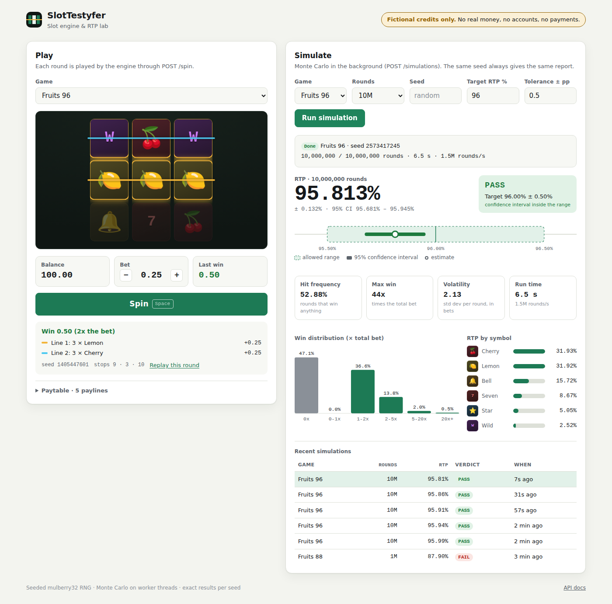

# SlotTestyfer

Slot machine engine and Monte Carlo tester written in TypeScript. It simulates millions of rounds
to measure a game's RTP (return to player), hit frequency and volatility, and gives a
PASS / FAIL / INCONCLUSIVE verdict against a target RTP, the way a game is checked before release.

> Fictional credits only. There is no real money, no player accounts and no payments.



## Status

| Phase | Scope                                                          | State |
| ----- | -------------------------------------------------------------- | ----- |
| 0     | Monorepo, TypeScript strict, lint, tests, CI, Docker           | done  |
| 1     | Game engine: seeded RNG, config, spin, paylines, wild, scatter | done  |
| 2     | Monte Carlo simulator, exact RTP, worker threads, verdict, CLI | done  |
| 3     | Fastify API, SQLite, background simulations, OpenAPI, Docker   | done  |
| 4     | Web interface: reels, balance, simulator dashboard             | done  |
| 4B    | Data analysis: sessions, drawdowns, percentiles                | next  |

## Quick start

Requires Node.js 22.13+ (for the built-in SQLite).

```bash
npm install
npm run check                                   # lint + format + build + tests
npm run simulate -- --game games/fruits-96.json --spins 10000000 --seed 42 --target 96
```

```
Game           Fruits 96 (fruits-96)
Run            10,000,000 rounds, seed 42, 8 workers
RTP            95.970% ± 0.132%  (95% CI 95.838% to 96.103%)
Hit frequency  52.91%
Max win        44x total bet
Volatility     2.133 (std dev per round, in total bets)
...
Verdict        PASS  target 96.00% ± 0.50%: confidence interval inside the range
```

## Web interface

```bash
npm run api     # terminal 1: the API on :3000
npm run web     # terminal 2: the interface on http://localhost:5173
```

- **Play**: reels, a fictional balance of 100.00, bet per line, winning paylines drawn on the reels,
  the round's seed and a button to replay it exactly.
- **Simulate**: pick a game and a number of rounds, follow the progress, and read the report: RTP
  with its 95% confidence interval drawn against the allowed range, PASS / FAIL / INCONCLUSIVE, hit
  frequency, volatility, the win distribution and how much each symbol adds to the RTP.

Plain TypeScript and Vite, no framework. The page always calls `/api`, which Vite (in
development) or nginx (in Docker) forwards to the API, so there is no CORS to configure.

## API

```bash
npm run api                  # http://localhost:3000, docs at http://localhost:3000/docs
docker compose up -d         # same, in a container, with the database in a volume
```

| Endpoint                | What it does                                                 |
| ----------------------- | ------------------------------------------------------------ |
| `GET /games`            | List the games                                               |
| `GET /games/{id}`       | Full configuration of a game                                 |
| `POST /games`           | Register a game (validated; every problem listed on 400)     |
| `POST /spin`            | One round with fictional credits; returns the seed to replay |
| `POST /simulations`     | Start a simulation in the background (202 + id)              |
| `GET /simulations/{id}` | Status, progress, report and verdict                         |
| `GET /simulations`      | Most recent simulations, optionally for one game             |
| `GET /health`           | Liveness check used by Docker                                |

```bash
curl -X POST localhost:3000/simulations -H 'content-type: application/json' \
  -d '{"gameId":"fruits-96","spins":10000000,"seed":42,"target":0.96}'
# -> 202 {"id":"…","status":"queued",…}
curl localhost:3000/simulations/<id>
# -> {"status":"done","progress":1,"report":{"rtp":0.9597,…},"verdict":{"status":"PASS",…}}
```

Simulations run one at a time on worker threads, so the API keeps answering while they run.
Progress is saved after every chunk. If the server stops mid-simulation, it is marked as failed on
the next start and anything still queued runs.

## Docker

```bash
docker compose up -d                   # web on :8080 and API on :3000, with healthchecks
docker compose run --rm simulator      # one-off simulation, JSON report in ./reports
docker build --target test -t slottestyfer:test . && docker run --rm slottestyfer:test
```

The image is multi-stage: the runtime stage has only production dependencies and compiled code,
and runs as the unprivileged `node` user. Pushing a tag such as `v1.0.0` publishes it to GitHub
Container Registry. Settings are in `.env.example`.

## How it works

```
packages/
├─ engine/      pure game logic, no I/O (runs in Node or a browser)
│   rng.ts        seeded mulberry32 PRNG, unbiased nextInt, deriveSeed
│   config.ts     game config schema (Zod) with cross-field checks
│   spin.ts       reel stops -> visible screen
│   evaluate.ts   line wins, wilds, scatters
│   round.ts      bet validation and payout in whole cents
├─ simulator/   Monte Carlo and analysis
│   stats.ts      running totals (constant memory, exact integers)
│   report.ts     RTP, hit frequency, volatility, confidence interval, verdict
│   exact.ts      exact RTP by playing every stop combination
│   simulate.ts   chunking and the worker thread pool
│   cli.ts        command line
├─ api/         HTTP API (Fastify)
│   store.ts      SQLite persistence (node:sqlite) behind a Store interface
│   runner.ts     background simulation queue
│   app.ts        routes, validation, errors, OpenAPI
│   server.ts     configuration from the environment, graceful shutdown
└─ web/         browser interface (TypeScript + Vite, served by nginx in Docker)
    game.ts       reels, balance, winning lines
    simulator.ts  simulation form, progress, report charts
    lib/          pure helpers (formatting, geometry, charts), unit tested
games/          game configurations (JSON)
```

**Reproducible.** Every random decision goes through a seeded RNG. A round is fully described by
its reel stops, so any result can be replayed and audited.

**Deterministic in parallel.** Rounds are split into fixed-size chunks and chunk _i_ always uses
seed `deriveSeed(seed, i)`. Totals are kept as exact integers (wins in line bets), so the same seed
gives the same report on 2 cores or 64.

**Verified two ways.** For small games the exact RTP is computed by playing every combination of
reel stops once. The tests check that the Monte Carlo estimate lands inside its confidence
interval around the exact value.

**Honest verdict.** The RTP is compared against `target ± tolerance` using the 95% confidence
interval: PASS if the whole interval is inside the range, FAIL if it is entirely outside, and
INCONCLUSIVE otherwise, with an estimate of how many rounds would settle it.

**Certification gate in CI.** Every push simulates `fruits-96` and the build fails if it stops
paying 96% ± 0.5%.

## Games

| File               | Exact RTP | Notes                                          |
| ------------------ | --------- | ---------------------------------------------- |
| `fruits-demo.json` | 94.25%    | 3x3, 5 paylines, wild and scatter              |
| `fruits-96.json`   | 95.94%    | Same reels, scatter pays more                  |
| `fruits-88.json`   | 87.98%    | Same reels, fruit pays less: fails a 96% check |

```bash
npm run simulate -- --game games/fruits-88.json --exact
```

## CLI

| Option             | Meaning                                                |
| ------------------ | ------------------------------------------------------ |
| `--game <file>`    | Game configuration (required)                          |
| `--spins <n>`      | Rounds to simulate (default 1,000,000; `10e6` works)   |
| `--seed <n>`       | Seed (default random, printed in the report)           |
| `--workers <n>`    | Worker threads (default: CPU cores)                    |
| `--target <pct>`   | Target RTP for the verdict, e.g. `96`                  |
| `--tolerance <pp>` | Allowed deviation in percentage points (default `0.5`) |
| `--exact`          | Exact RTP by playing every stop combination            |
| `--json` / `--out` | Print or save the report as JSON                       |

Exit codes: `0` PASS (or no target), `1` FAIL, `2` INCONCLUSIVE, `3` bad input.

## Scripts

| Script             | What it does                    |
| ------------------ | ------------------------------- |
| `npm test`         | Run the test suite (Vitest)     |
| `npm run lint`     | ESLint                          |
| `npm run format`   | Format all files with Prettier  |
| `npm run build`    | Compile all packages            |
| `npm run simulate` | Build and run the simulator CLI |
| `npm run check`    | Everything CI runs              |

## Conventions

- Commits follow [Conventional Commits](https://www.conventionalcommits.org/)
  (`feat:`, `fix:`, `test:`, `chore:`, `ci:`, `docs:`).
- Work happens on branches and reaches `main` through pull requests.
- Credits are integers in cents; pays are whole multipliers, so every payout is exact.
- The RNG (mulberry32) is not cryptographically secure. Real-money games need a certified RNG.
